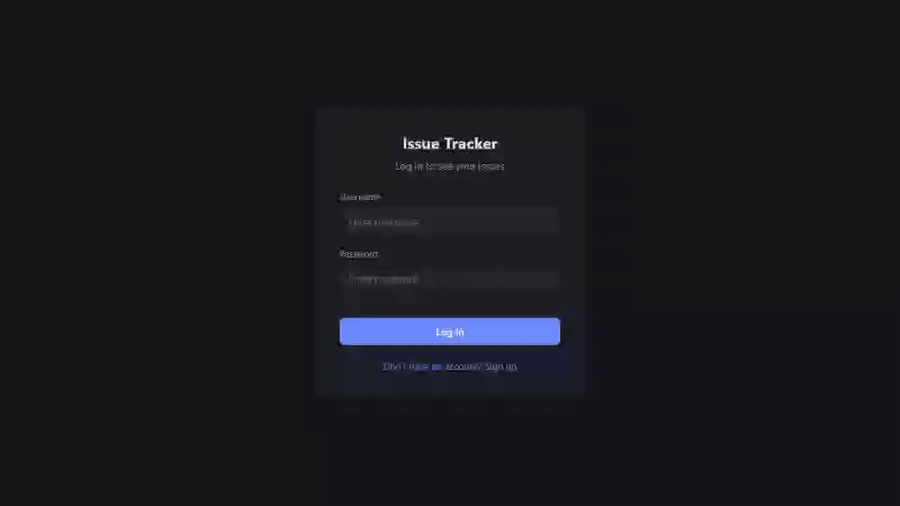
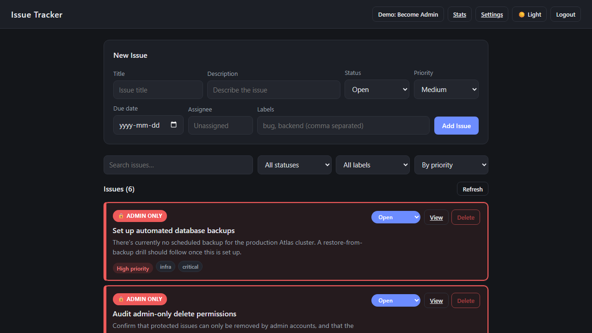
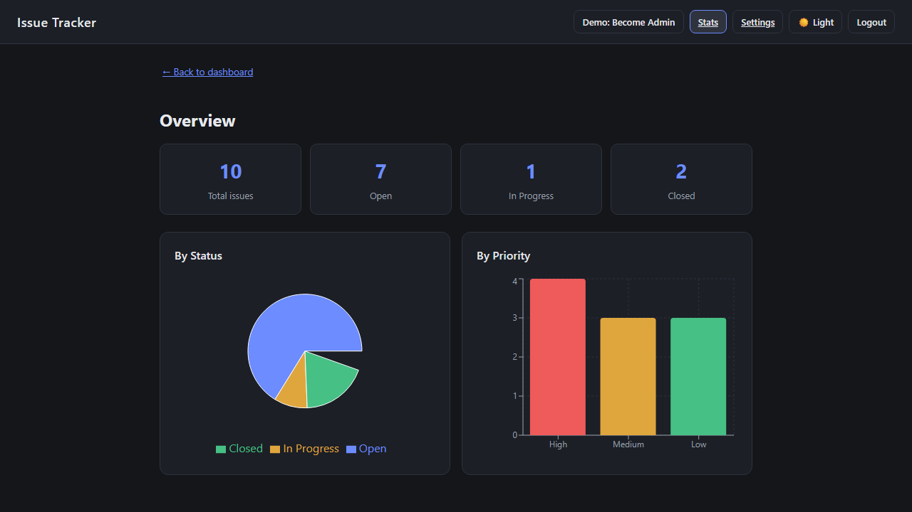
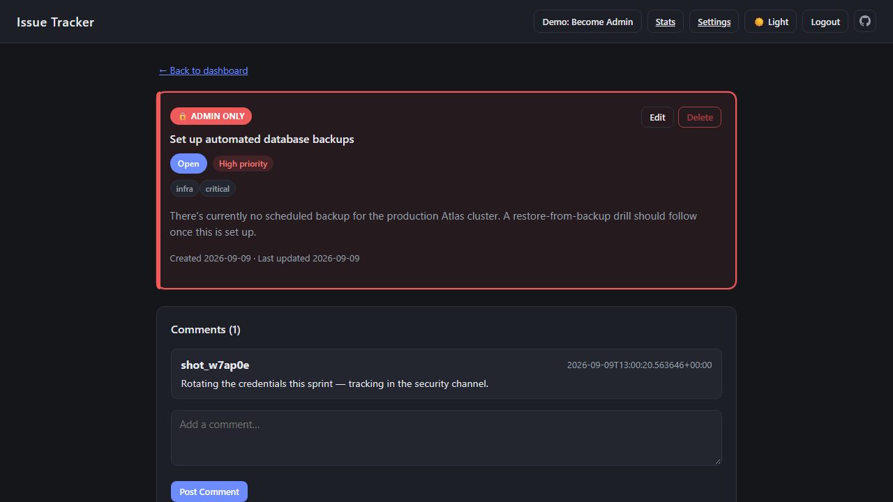
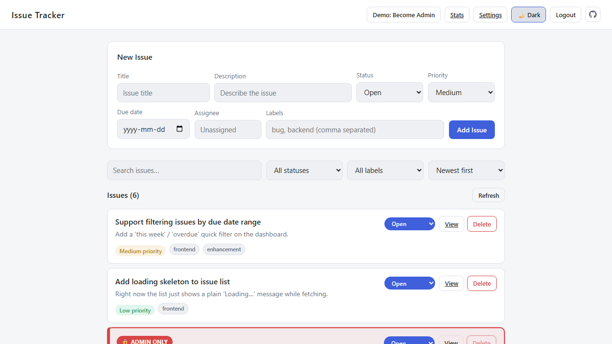
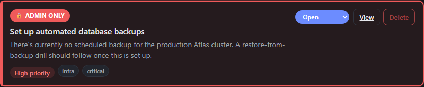

# Issue Tracker

A full-stack issue tracker built with **React** and **FastAPI**, backed by **MongoDB Atlas** and deployed on **Vercel**. Users sign up, manage their own issues, comment on them, and view stats — with a role-based permission rule that stops non-admins from deleting sensitive issues.

> **Live demo:** _add your Vercel URL here_



*(Higher quality version: [`docs/demo.mp4`](docs/demo.mp4). The clip above is generated automatically by the Playwright e2e suite — see [Tests](#tests).)*

---

## Tech stack

| Layer | Choice |
| --- | --- |
| Frontend | React 19 (Vite), React Router, Axios, Recharts |
| Backend | FastAPI, Pydantic, python-jose (JWT), Passlib + bcrypt |
| Database | MongoDB Atlas (PyMongo) |
| Tests | pytest (API), Playwright (end-to-end) |
| Hosting | Vercel (frontend + backend in one project via Vercel Services) |

---

## Features

- **JWT authentication** — signup, login, and a change-password flow that re-verifies the current password.
- **Issue CRUD** — title, description, status, priority, labels, due date, and assignee.
- **Admin-only protected issues** — sensitive issues are flagged `is_protected` and can only be deleted by an admin. Enforced server-side (see [Authorization](#authorization-the-interesting-part)).
- **Comments** on individual issues.
- **Search, filter, and sort** by text, status, label, priority, or due date.
- **Pagination** — the API takes `skip`/`limit`; the dashboard pages through 6 at a time.
- **Stats page** — a MongoDB aggregation pipeline powers status/priority charts.
- **Optimistic UI updates** — status changes apply instantly and roll back if the request fails.
- **Overdue detection**, dark/light theme, toasts, empty states, and a 404 page.
- **Seeded sample data** — every new account starts with 10 realistic issues (3 protected) so the app is never an empty screen.

---

## Screenshots

| Dashboard | Stats |
| --- | --- |
|  |  |

| Issue detail | Light theme |
| --- | --- |
|  |  |

---

## Architecture

```text
IssueTracker/
├── Backend/                  # FastAPI service
│   ├── main.py               # App entry point, CORS config
│   ├── auth.py               # JWT settings, password hashing, request models
│   ├── config/database.py    # MongoDB connection (Atlas, local fallback)
│   ├── models/issues.py      # Pydantic models
│   ├── schema/schemas.py     # Mongo document → JSON serializers
│   ├── routes/route.py       # All API routes + sample-data seeding
│   └── tests/                # pytest API tests
├── FrontEnd/                 # React app (Vite)
│   ├── src/api.js            # Axios instance: attaches JWT, handles 401s
│   ├── src/context/          # Auth, theme, and toast providers
│   ├── src/pages/            # Dashboard, IssueDetail, Stats, Settings, Auth, 404
│   └── e2e/                  # Playwright end-to-end tests
├── docs/                     # Screenshots + demo recording
└── vercel.json               # Routes /auth/* to the backend, everything else to the frontend
```

### Request flow

The frontend never talks to MongoDB directly. Every action goes through the API:

```
React (Axios)  →  /auth/*  →  FastAPI route  →  auth dependency (JWT)  →  PyMongo  →  Atlas
```

`src/api.js` holds a single Axios instance with two interceptors: one attaches the bearer token to every request, the other catches `401`s, clears the stored token, and bounces the user back to `/login`.

### Authentication

Passwords are hashed with bcrypt (via Passlib) and never stored or returned in plain text. Login issues a JWT containing the username, user id, and an `is_admin` claim, expiring after 20 minutes. `get_current_user` is a FastAPI dependency that decodes the token and rejects invalid or expired ones with a `401` — protected routes just declare it and receive the authenticated user.

Every issue stores an `owner_id`, and all queries are scoped to the requesting user, so accounts can't read or modify each other's data. There's a test for exactly that (`test_users_cannot_see_each_others_issues`).

### Authorization (the interesting part)

Some seeded issues represent sensitive work — rotating production credentials, setting up backups, auditing permissions. Those are marked `is_protected` and can only be deleted by an admin:



```python
if issue.get("is_protected") and not current_user.get("is_admin"):
    raise HTTPException(
        status_code=status.HTTP_403_FORBIDDEN,
        detail="This issue is protected and can only be deleted by an admin.",
    )
```

Two details that matter more than the check itself:

1. **The UI is not the security boundary.** The dashboard disables the delete button for non-admins, but that's only a convenience. The rule lives in the API, so calling the endpoint directly still returns `403`.
2. **`is_protected` isn't editable.** It's deliberately left out of the `IssueUpdate` model, so a user can't `PATCH` their own issue to unprotect it and route around the rule. There's a test asserting this (`test_client_cannot_set_is_protected_via_patch`).

Since this is a portfolio demo rather than a real product, there's a **"Demo: Become Admin"** button that flips the logged-in user's own `is_admin` flag and re-issues their token, so anyone can try the permission rule without a second account. A real app would obviously never let a user grant themselves privileges — it's labelled as a demo affordance in both the UI and the code.

---

## Running locally

**Prerequisites:** Python 3.12+, Node 18+, and either a MongoDB Atlas cluster or a local `mongod`.

**1. Environment variables** — create a `.env` in the repo root:

```env
SECRET_KEY=<a long random string>
ALGORITHM=HS256
MONGO_USER=<atlas user>
MONGO_PASS=<atlas password>
```

If Atlas is unreachable, the backend falls back to a local MongoDB at `mongodb://localhost:27017` so you can still work offline.

**2. Backend**

```bash
python -m venv env
env\Scripts\activate          # macOS/Linux: source env/bin/activate
pip install -r Backend/requirements.txt
cd Backend && uvicorn main:app --reload
```

Runs at `http://localhost:8000`, with interactive API docs at `/docs`.

**3. Frontend**

```bash
cd FrontEnd
npm install
npm run dev
```

Runs at `http://localhost:5173`.

There's also a root-level `npm run dev` that starts both at once with `concurrently`.

---

## Tests

**API tests (pytest)** — 21 tests covering auth, CRUD, pagination, comments, stats, data isolation between users, and the admin permission rule. They run against a separate `issue_tracker_test_db` database, so they never touch real data.

```bash
cd Backend
python -m pytest -v
```

**End-to-end tests (Playwright)** — drives a real browser through signup, issue creation, the protected-delete rule, and the stats page. Playwright starts and stops both servers itself.

```bash
cd FrontEnd
npm run test:e2e            # run the suite
npm run test:e2e:report     # open the HTML report
```

The demo recording at the top of this README is the video artifact from the `walkthrough for the demo recording` test, so it can't drift out of date without the test failing first.

---

## Deployment

Deployed as a single Vercel project using [Vercel Services](https://vercel.com/docs/services), which lets the React frontend and the FastAPI backend build separately but share one domain:

```json
{
  "services": {
    "frontend": { "root": "FrontEnd/" },
    "backend": { "root": "Backend/", "entrypoint": "main:app" }
  },
  "rewrites": [
    { "source": "/auth/(.*)", "destination": { "service": "backend" } },
    { "source": "/(.*)", "destination": { "service": "frontend" } }
  ]
}
```

Because both services share a domain, the frontend uses relative API paths in production and no CORS configuration is needed. `SECRET_KEY`, `ALGORITHM`, `MONGO_USER`, and `MONGO_PASS` are set as environment variables in the Vercel project.

One deployment gotcha worth noting: MongoDB Atlas blocks connections from unknown IPs, and Vercel functions don't have static ones, so the cluster's network access list has to allow `0.0.0.0/0`.

---

## Things I'd do next

- Replace the free-text `assignee` field with real user references.
- Add refresh tokens so sessions outlive the 20-minute access token.
- Rate-limit `/auth/token` to slow down brute-force attempts.
- Code-split the frontend bundle — Recharts pushes it over 500 kB.
